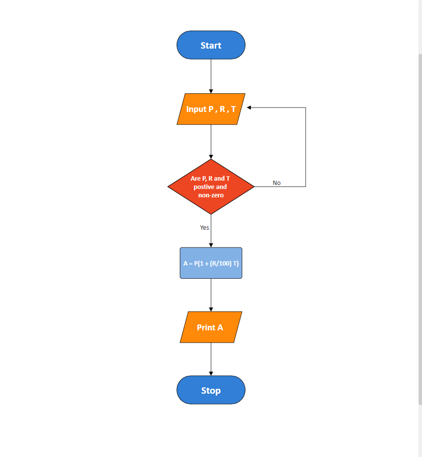
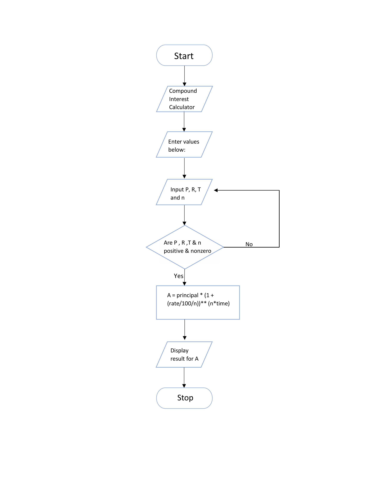
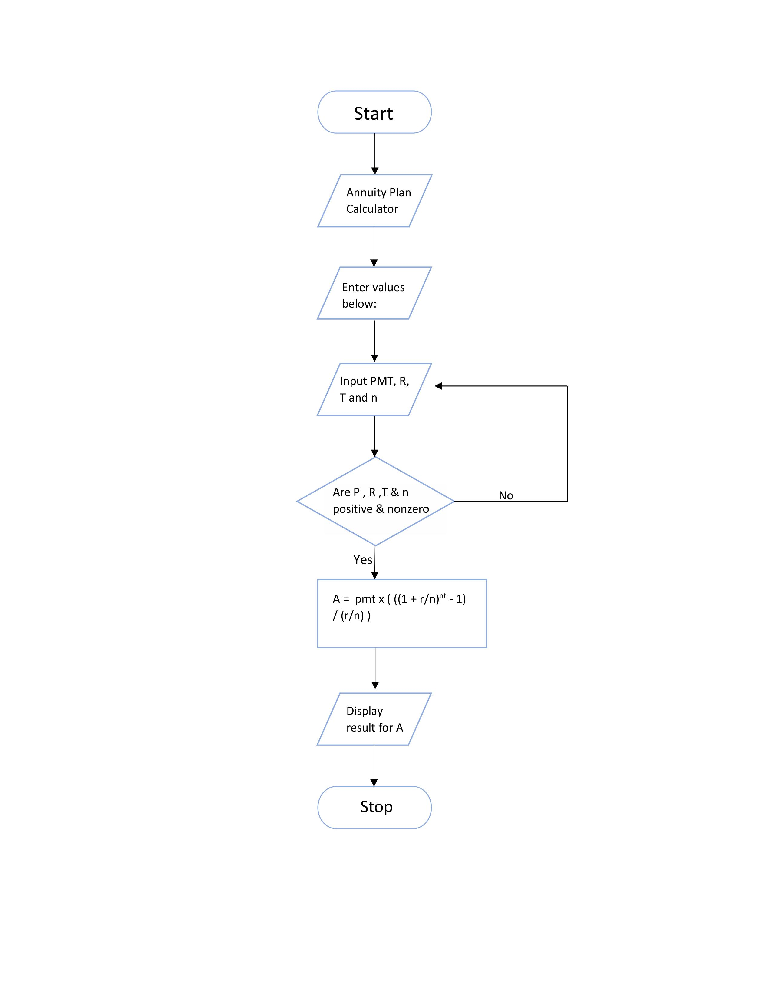

{
 "cells": [
  {
   "attachments": {},
   "cell_type": "markdown",
   "id": "de127406-5035-407b-b310-f7353389279a",
   "metadata": {},
   "source": [
    "Flowchart for Simple Interest\n",
    ""
   ]
  },
  {
   "cell_type": "markdown",
   "id": "569afc60-0bcb-4c32-bf32-1cd404d4c568",
   "metadata": {},
   "source": [
    "Flowchart for Compound Interest\n",
    ""
   ]
  },
  {
   "cell_type": "markdown",
   "id": "6ecc5548-2e3a-43f0-85f7-7d2db6b05091",
   "metadata": {},
   "source": [
    "Flowchart for Annuity Plan\n",
    ""
   ]
  }
 ],
 "metadata": {
  "kernelspec": {
   "display_name": "Python [conda env:base] *",
   "language": "python",
   "name": "conda-base-py"
  },
  "language_info": {
   "codemirror_mode": {
    "name": "ipython",
    "version": 3
   },
   "file_extension": ".py",
   "mimetype": "text/x-python",
   "name": "python",
   "nbconvert_exporter": "python",
   "pygments_lexer": "ipython3",
   "version": "3.13.5"
  }
 },
 "nbformat": 4,
 "nbformat_minor": 5
}
